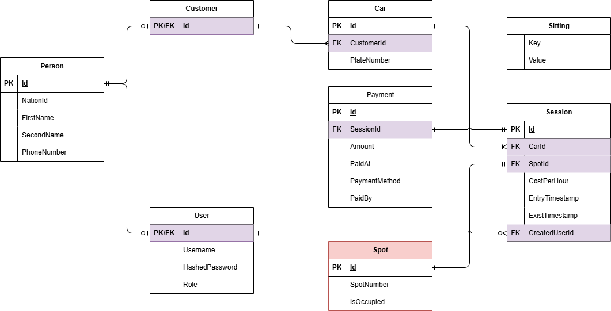

# 🚗 Parking Garage Management System (Backend)

A **Parking Garage Management System** developed using **C# and .NET**, following **Clean Architecture** principles.  
This project simulates real-world parking garage operations with a strong focus on **separation of concerns**, **maintainability**, and **scalable API design**.

---

## 📌 Project Overview

This backend system manages core parking garage functionalities, including:  
- Users authentication and authorization  
- Vehicles and parking sessions  
- Payments
- Reporting garage usage and occupancy  

The project is structured using **Clean Architecture**, separating:  
- **Presentation Layer (API Controllers)**  
- **Application Layer (Services, DTOs, Mappers)**  
- **Domain Layer (Entities, Interfaces)**  
- **Infrastructure Layer (Repositories, Database, Logging, External Services)**  

---

## 🧱 Architecture

The application follows **Clean Architecture**:

### 🔹 Presentation Layer
- Handles API requests  
- Returns responses to clients  
- Includes **Action Filters** to validate inputs (e.g., pageNumber, pageSize, Id)  
- Includes **Middleware** for logging with Serilog 
- Does not contain business logic  

### 🔹 Application Layer
- Contains **business rules**  
- Coordinates between Presentation and Domain layers  
- Contains DTOs, and service interfaces  

### 🔹 Domain Layer
- Contains **core entities and interfaces**  
- Represents business logic independent of frameworks  

### 🔹 Infrastructure Layer
- Implements repository interfaces  
- Handles **database operations** using **Entity Framework Core**  
- Integrates **Middleware for logging with Serilog**  
- Handles external service interactions (e.g., email notifications, file storage)  

---

## 🗃️ Database Design

The database is designed to reflect real parking garage operations, including:  
- Users and roles  
- Vehicles and parking sessions  
- Payments and transaction history  
- Logs and audit tables  

### 📊 ERD Diagram


---

## ⚙️ Features

### 👤 User Management
- JWT-based authentication  
- Role-based authorization (Admin, Staff)  
- Secure password storage and validation  

### 🚗 Vehicle & Parking Session Management
- Add, update, and remove vehicles  
- Start, update, and close parking sessions  
- Validate parking session data using **Action Filters**  

### 💰 Payments
- Record payments for parking sessions  
- Support multiple payment methods  
- Ensure database consistency with transactions  

### 📝 Logging & Error Handling
- Centralized logging using **Serilog Middleware**  
- Logs requests, responses, and errors  
- Provides detailed diagnostic information for debugging  

### 🛡️ Validation
- Action Filters validate critical parameters such as `pageNumber`, `pageSize`, and `Id`  
- Prevents invalid requests from reaching the business layer  

### 📄 API Documentation
- **Swagger/OpenAPI** integrated  
- Enables easy exploration and testing of endpoints  

---

## 🛠️ Technologies Used

- **Programming & Frameworks:** C#, .NET 8, ASP.NET Core Web API  
- **Database:** SQL Server, EF Core, Migrations  
- **Security:** JWT Authentication, Role-based Authorization 
- **Logging & Monitoring:** Serilog Middleware  
- **Patterns & Principles:** Clean Architecture, DTOs, Separation of Concerns, Action Filters  

---

## 📂 Project Structure (Simplified)

```
ParkingGarageBackend
│
├── Presentation
│   ├── Controllers
│   ├── Middleware (Serilog Logging)
│   └── Filters (Action Filters for validation)
│
├── Application
│   ├── Services
│   ├── Mappers
│   ├── DTOs
│
├── Domain
│   ├── Entities
│   └── RepositoryInterfaces
│
├── Infrastructure
│   ├── Repositories
│   ├── Database
│   └── ExternalServices
│
├── docs
│   └── ERD.png
│
├── database
│   ├── Schema.sql
│   └── Seed-Data.sql
│
└── README.md
```

---

## ▶️ How to Run the Project

1. Clone the repository:

```bash
git clone <repository-url>
```

2. Open the solution in Visual Studio or VS Code  
3. Configure the SQL Server connection string in `appsettings.json`  
4. Apply database migrations:

```bash
dotnet ef database update
```

5. Run the application:

```bash
dotnet run
```


